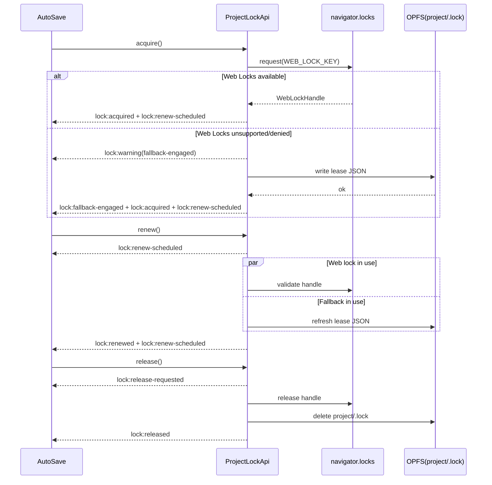

# プロジェクトロック イベント設計サマリ

## 1. ガードレールと適用範囲
- 実装対象: `src/lib/locks.ts` が提供する `ProjectLockApi`。
- Day8 アーキテクチャ領域（Collector / Analyzer / Reporter）に属する OPFS パスには書き込まない。ロック関連ファイルは `project/.lock` のみ。
- AutoSave 以外のサービスがロックを利用する場合でも、Web Locks → フォールバックの優先順位とイベント契約を共有する。

## 2. 制御フロー (Mermaid)

## 3. 競合・エラー ハンドリング
| ケース | 発生条件 | 発火イベント | 返却エラー | 備考 |
| --- | --- | --- | --- | --- |
| Web Locks 未実装 | `navigator.locks?.request` が無い | `lock:error` (retryable=true), `lock:warning(fallback-engaged)` | `ProjectLockError(code='web-lock-unsupported')` | 次の試行でフォールバックを強制。 |
| フォールバック競合 | `project/.lock` の `leaseId` が異なるかつ `expiresAt > now` | `lock:error` (retryable=true), `lock:warning(fallback-degraded)`, `lock:waiting` | `ProjectLockError(code='fallback-conflict')` | 指数バックオフ後に再試行。 |
| リース喪失 | `.lock` 削除済み / WebLockHandle 無効 | `lock:error` (retryable=false), `lock:readonly-entered` | `ProjectLockError(code='lease-stale')` | AutoSave を read-only へ遷移。 |
| 更新遅延 | `renew()` 呼出時に `Date.now() > lease.nextHeartbeatAt` | `lock:warning(heartbeat-delayed)` | なし | 監査ログ向け警告。 |
| 解放失敗 | ハンドル解放/ファイル削除が失敗 | `lock:error`, `lock:readonly-entered` (retryable=false) | `ProjectLockError(code='release-failed')` | `.lock` 残存時は手動削除を促す。 |

## 4. テスト仕様スナップショット
| シナリオ | ステップ | 期待観測 |
| --- | --- | --- |
| Web Locks 正常系 | acquire → renew → release | `lock:attempt` → `lock:acquired` → `lock:renew-scheduled`。更新時は `lock:renew-scheduled` → `lock:renewed` → `lock:renew-scheduled`。 |
| Web Locks 不可 | `navigator.locks` 未定義 → acquire | `lock:error(code=web-lock-unsupported)` 後に `lock:warning(fallback-engaged)` → `lock:fallback-engaged`。 |
| フォールバック競合 | 先行リースを保持した状態で acquire | `lock:error(code=fallback-conflict)` と `lock:waiting(delayMs)` を受信し、最終的に例外。 |
| 非再試行エラー | `withProjectLock` 内で `retryable=false` エラー送出 | `lock:error` → `lock:readonly-entered` が 1 度だけ通知される。 |

## 5. 監査・AutoSave 整合性
- すべての `ProjectLockError` は `lock:error` 経由で監査ストリームに露出。`retryable=false` の場合に限り read-only 遷移イベントが続く。
- `lock:renew-scheduled` は取得直後と更新完了後の双方で送出し、AutoSave のタイマー実装が TTL/ハートビートを判定できるようにする。
- イベントサブスクライバは Backoff 情報 (`lock:waiting.delayMs`) と警告 (`lock:warning.*`) を利用し、UI とログの双方で競合状況を可視化する。
