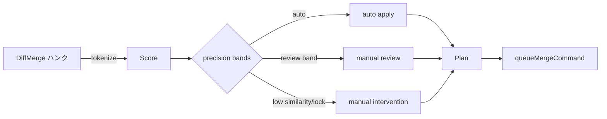

# 精緻マージ 3-way パイプライン仕様

## 1. フロー概要
- DiffMerge セクションを分割 → `scoreSection` が `MergeScoringStrategy` を呼び出しメトリクスを取得。
- `decideSection` が `blended` 類似度を precision バンド（auto/review/conflict）に分類。
- セクションごとの決定を `MergePlanEntry` に変換し、Phase A/B の推奨キュー操作を抽出。
- `queueMergeCommand` は `recommendedCommand` を参照して UI オペレーション（自動適用/レビュー要求/手動介入/ロック解消）を直列化。

## 2. precision 別バンド/推奨コマンド
| precision | auto しきい値 | review しきい値 | `MergePlanBand` | `recommendedCommand` | Phase B 必要条件 |
| --- | --- | --- | --- | --- | --- |
| legacy | `threshold+0.08` (最小 0.65) | `threshold-0.04` | auto のみ Phase A | `queue:auto-apply` | `required=false` 固定 |
| beta | `clamp(threshold+0.05,0.8,0.92)` | `threshold-0.02` | review バンドで `band='review'` | `queue:request-review` | review エントリが存在すれば `reasons` に `review-band` |
| stable | `clamp(threshold+0.03,0.86,0.95)` | `threshold-0.01` | review/低類似/ロックを Phase B へ集約 | `queue:request-review` / `queue:manual-intervention` / `queue:force-lock-resolution` | Phase B は review/locked/low-similarity の合算 > 0 |

## 3. MergePlan 出力契約
- `summary.phaseA` / `summary.phaseB` で自動適用と介入対象を切り分け。
- `phaseB.reasons` は `{ 'review-band' | 'locked-conflict' | 'low-similarity' }` を重複無しで列挙。
- `precision='legacy'` では `phaseB.required=false`。`beta/stable` で Phase B 条件を満たした場合のみ true。

## 4. テスト観点
1. legacy: 全ハンク `band='auto'`, `phaseB.required=false`, `queue:auto-apply`。
2. beta: auto+review 混在で `review` エントリが Phase B へ入り `queue:request-review` が推奨される。
3. stable: 低類似またはロックで `band='conflict'`, `recommendedCommand='queue:manual-intervention'` or `queue:force-lock-resolution`。
