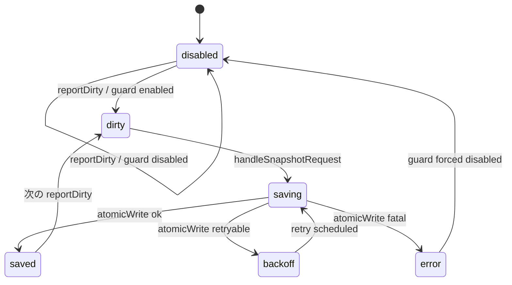
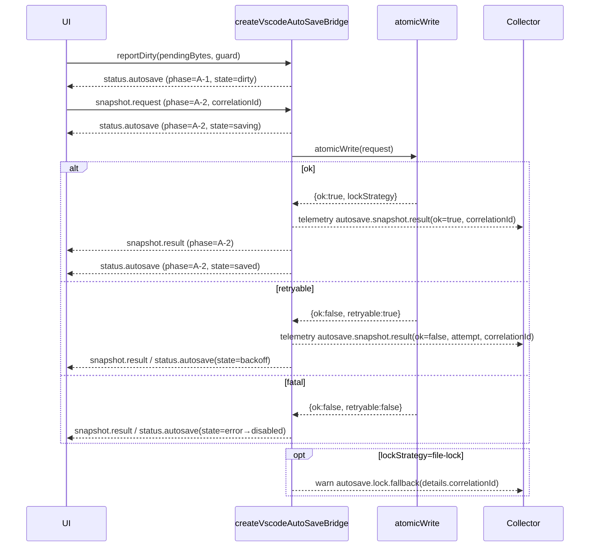

# VS Code AutoSave ブリッジ設計

## 1. 背景と参照
- `docs/AUTOSAVE-DESIGN-IMPL.md` の保存ポリシー (デバウンス 500ms / アイドル 2s / 世代 20 / 容量 50MB) を Phase A 固定値として採用する。【F:docs/AUTOSAVE-DESIGN-IMPL.md†L33-L63】
- `docs/src-1.35_addon/API-CONTRACT-EXT.md` の封筒型契約 (`apiVersion=1`, `phase`, `bridgePhase`, `correlationId`) を VS Code ブリッジのメッセージヘッダに適用する。【F:docs/src-1.35_addon/API-CONTRACT-EXT.md†L15-L58】
- `Day8/docs/day8/design/03_architecture.md` の Collector/Analyzer 境界を踏襲し、Telemetry JSONL へ `correlationId` を渡す (参照: AutoSave イベント SLO)。【F:Day8/docs/day8/design/03_architecture.md†L42-L78】

## 2. メッセージ契約
| フィールド | 型 | 説明 | 実装 | テスト |
| --- | --- | --- | --- | --- |
| `apiVersion` | `1` | 契約バージョン。Phase A 固定。 | `AutoSaveBridgeEnvelope` が固定値をセット。【F:src/lib/autosave.ts†L170-L209】 | `snapshot.result` / `status.autosave` が `1` を保持することを検証。【F:tests/webview/autosave.vscode.test.ts†L52-L90】 |
| `phase` | `'A-0'｜'A-1'｜'A-2'｜'B-0'｜'B-1'` | Phase ガードの監視値。保存フローは `A-2`。 | `createStatusMessage` / `createSnapshotResultMessage` が `PHASE_STATUS` / `request.phase` を反映。【F:src/platform/vscode/autosave.ts†L110-L167】 | `saving` ステータスと `snapshot.result` が `A-2` を共有する。 【F:tests/webview/autosave.vscode.test.ts†L76-L89】 |
| `bridgePhase` | `'status.autosave'` 等 | UI ↔ ブリッジ状態機械のサブフェーズ。 | 全メッセージで `bridgePhase` を明示。【F:src/platform/vscode/autosave.ts†L110-L167】 | テストで `bridgePhase` を暗黙利用 (状態フィルタ)。 |
| `correlationId` | `string` | Telemetry/RPC へ伝播する相関 ID。 | `reportDirty` が採番、`snapshot.request` は Webview 指定値を使用。【F:src/platform/vscode/autosave.ts†L192-L236】 | Warn/Telemetry の details/properties に含める。 【F:tests/webview/autosave.vscode.test.ts†L122-L139】 |

## 3. 状態機械

- `status.autosave` の `state`/`phase` を同期させて UI へ露出。`saving/backoff/error` は `phase='A-2'` で固定する。【F:src/platform/vscode/autosave.ts†L221-L287】
- 非 retryable エラー時は `error` → `disabled` を連続送信し、Phase ガードを optionsDisabled=true に強制する。【F:src/platform/vscode/autosave.ts†L167-L191】

## 4. メッセージシーケンス

## 5. RED テストケース
| ケース | 目的 | 担当テスト |
| --- | --- | --- |
| dirty→saving→saved | Phase A 既定値で状態遷移・ヘッダ同期を確認 | `tests/webview/autosave.vscode.test.ts` 「emits dirty→saving→saved…」【F:tests/webview/autosave.vscode.test.ts†L52-L100】 |
| 世代/容量ガード | 履歴の FIFO/容量制御を確認 | 同ファイル 「enforces history max generations…」【F:tests/webview/autosave.vscode.test.ts†L102-L121】 |
| 非 retryable エラー降格 | `error→disabled` と guard 固定化 | 同ファイル 「downgrades to disabled…」【F:tests/webview/autosave.vscode.test.ts†L123-L152】 |
| .lock フォールバック warn | warn telemetry に correlationId を含める | 同ファイル 「emits warn telemetry…」【F:tests/webview/autosave.vscode.test.ts†L154-L172】 |
| Guard 無効化ショートサーキット | Phase ガード無効時の即時 disabled 応答 | 同ファイル 「short-circuits snapshot…」【F:tests/webview/autosave.vscode.test.ts†L174-L196】 |

## 6. RPC / Telemetry マッピング
| イベント | RPC | Telemetry | 備考 |
| --- | --- | --- | --- |
| `reportDirty` | RPC 無し | `autosave.status(state=dirty, correlationId)` | Guard 無効時は state=disabled を送信。 |
| `handleSnapshotRequest` (saving) | `atomicWrite` 呼出 | `autosave.status(state=saving)` (corrId 共有) | `pendingBytes` をメッセージ payload に反映。 |
| `atomicWrite` 成功 | `atomicWrite` | `autosave.snapshot.result(ok=true, retainedBytes)` | `.lock` フォールバック時は warn も送信。 |
| `atomicWrite` retryable | `atomicWrite` | `autosave.snapshot.result(ok=false, retryable=true, attempt)` | `status.autosave(state=backoff)` と同じ corrId。 |
| `atomicWrite` fatal / throw | - | `autosave.snapshot.result(ok=false, retryable=false)` | 状態は `error→disabled`、guard.optionsDisabled=true。 |

## 7. Phase ガード / correlationId の扱い
- Guard 無効化時は `status.autosave(state='disabled', phase='A-1')` を採番し、`atomicWrite` を呼び出さない。【F:src/platform/vscode/autosave.ts†L192-L211】
- Webview からの `snapshot.request` に含まれる `correlationId` を `snapshot.result`・`status.autosave`・Telemetry・Warn にそのまま伝搬する。【F:src/platform/vscode/autosave.ts†L212-L315】
- `.lock` フォールバック利用時は warn の details に `reqId` と `correlationId` を含め Collector 側の Phase ガード分析を可能にする。【F:src/platform/vscode/autosave.ts†L264-L269】
