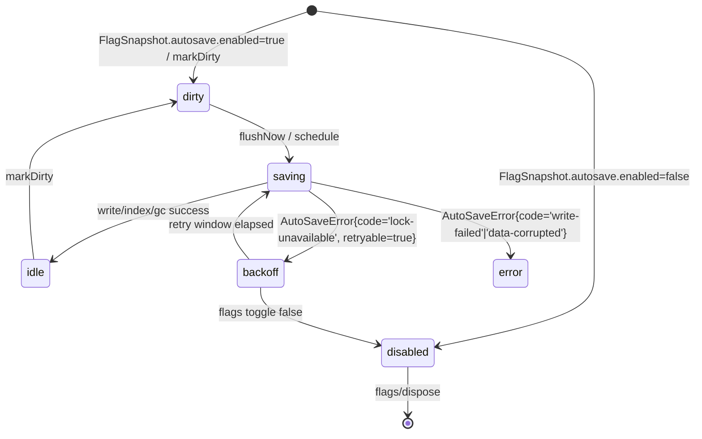

# AUTOSAVE — 保存仕様

## 1. 目的
- 編集中の喪失を防ぎ、**2.5秒以内に永続化**。
- 破損防止のため**アトミック保存**を行う。

## 2. アルゴリズム
- 入力発生→**デバウンス ~500ms**。アイドル2sで確定。
- 保存手順: `write(tmp)` → `fsync` → `rename(tmp -> target)`。
- 成功時に `history/<iso>.json` へ世代保存（N=20 / 合計50MB）。

## 3. UI
- インジケータ：`↻`（保存中）→`○`（保存済）。
- 復旧ダイアログ：起動時に履歴あり・破損時は選択復旧。

## 4. 排他
- PWA単一タブ前提。拡張化時は拡張側で擬似ロックを付与。

## 5. Phase A ガード統合設計

### 5.1 状態遷移図

### 5.2 I/O マトリクス（initAutoSave フェーズ判定）
| Input条件 | 判定順序 | 出力状態 (`snapshot().phase`) | flushNow | dispose | Telemetry |
| --- | --- | --- | --- | --- | --- |
| `FlagSnapshot.autosave.enabled=false` | 1 | `disabled` | `AutoSaveError{ code='disabled', retryable=false }` | `noop` | `collector.debug: autosave.disabled` |
| `options.disabled=true` | 2 | `disabled` | 同上 | 同上 | 同上（`context.source='options'`） |
| `lock` 取得成功 | 3 | `saving` → `idle` | 世代保存・履歴 FIFO (`maxGenerations=20`, `maxBytes=50MB`) | lock 解放 | `collector.info: autosave.flush` |
| `lock` 失敗（WebLock→.lock 両方） | 4 | `backoff` | `AutoSaveError{ code='lock-unavailable', retryable=true }` | `noop` | `collector.warn: autosave.lock.retry` |
| 世代/容量上限超過 | 5 | `saving` 継続 | FIFO GC 実行。復旧失敗で `AutoSaveError{ code='history-overflow', retryable=false }` | `stop` | `collector.info: autosave.gc.pruned` |

### 5.3 履歴ロールバック条件
- GC 後も `maxGenerations` / `maxBytes` を超える場合は `history-overflow` を発行し runner を停止、UI へ `phase='error'` を伝播。
- GC 成功時は `index.json` を更新し、削除世代の `retained=false` を Collector に送信。Analyzer は Phase ガード解除後も履歴保持を追跡。
- `FlagSnapshot.autosave.enabled` が `false` に戻った場合、未コミット世代を破棄して `phase='disabled'` へ即遷移。履歴ファイルのロールバックは行わない。

### 5.4 Telemetry / Lock 優先順位
- Web Lock を最優先し、失敗時に `.lock` フォールバックを試行。両方失敗時のみ `backoff` 遷移。
- Telemetry は `phaseBefore`/`phaseAfter`/`flagSource`/`lockStrategy` を含め、Collector → Analyzer が Phase ロールバック判断に利用。
- `AutoSaveError.retryable=true` のケースでは指数バックオフスケジューラを再設定しつつ `snapshot().retryCount` をインクリメント。

### 5.5 RED テストケース
- `tests/lib/autosave.phase-guard.test.ts`
  - `phase guard stops runner when flag disabled`
  - `phase guard keeps dirty snapshot when enabled and generation queued`
  - `saving phase holds lock before history write`
  - `backoff phase surfaces retryable error when Web Lock fails and .lock fallback pending`

