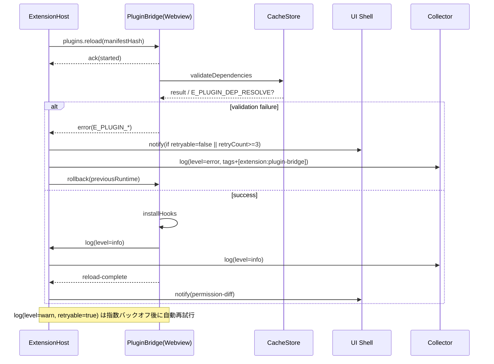

# PLUGIN-API — Conimg独自プラグイン v1

## 1. 配置
- `<workspace>/.conimgponic/plugins/<name>/conimg-plugin.json` + `index.js`。

## 2. マニフェスト要件と検証フロー

### 2.1 フィールド一覧

| フィールド | 型 / 必須 | 制約 | 備考 |
| --- | --- | --- | --- |
| `name` | string / 必須 | npm パッケージと同じ命名規約、32 文字以内 | UI・ログに表示。 |
| `version` | string / 必須 | semver (`major.minor.patch`) | `plugins.reload` の互換判定で使用。 |
| `conimg-api` | string / 必須 | 例: `"1"` または `"1.x"` | 現行は `1` 系のみサポート。 |
| `entry` | string / 任意 | 既定 `index.js` | webview ローダーに渡されるパス。 |
| `permissions` | string[] / 任意 | 既定 `[]`。`fs`、`workspace:settings`、`ui:*`、`network:*` 等。 | 未宣言は拒否。 |
| `hooks` | string[] / 任意 | 既定 `[]` | §3 のフック名を列挙。 |
| `dependencies` | object / 任意 | `{ "npm": { ... }, "workspace": [ ... ] }` | `npm` は `package.json` プロキシ。`workspace` は watch 対象。 |
| `capabilities` | object / 任意 | `{"widgets": true, "commands": true}` 等 | UI への露出許可。 |
| `telemetry` | object / 任意 | `{ "tags": ["sample"] }` | Collector 連携時の既定タグ。 |

### 2.2 検証ステージ
1. **構文検証**: JSON スキーマを適用。欠落/型不整合は `E_PLUGIN_MANIFEST_INVALID (retryable=false)`。
2. **互換性チェック**: `conimg-api` の範囲が Extension Host のサポートと合致しない場合は `E_PLUGIN_API_UNSUPPORTED (retryable=false)`。
3. **権限ゲート**: §2.3 を参照。未承認の権限が追加された場合はユーザ確認待ちで `E_PLUGIN_PERMISSION_PENDING (retryable=true)`。
4. **依存キャッシュ整合**: §2.4 のポリシーに従い、ハッシュ差分が見つかれば再解決を行い、失敗時は `E_PLUGIN_DEP_RESOLVE (retryable=true)`。
5. **フック登録**: 宣言されたフックが §3 の要件を満たさない場合は `E_PLUGIN_HOOK_INVALID (retryable=false)`。

検証は `plugins.reload` / 初回ロード共通のステートマシンとして扱い、`retryable` 属性は AutoSave 設計（`docs/AUTOSAVE-DESIGN-IMPL.md`）を踏襲する。

### 2.3 権限モデル
- **宣言必須**: `fs`, `network:*`, `workspace:*`, `ui:*`。暗黙付与は行わない。
- 権限差分の評価順: manifest → 既存許可 → UI 承認。拒否された場合は `E_PLUGIN_PERMISSION_DENIED (retryable=false)` として旧バージョンへロールバック。
- 権限承認結果と `retryable` 判定は Day8/Collector へのログ転送と整合させる（`Day8/docs/day8/design/03_architecture.md`）。
- `workspace:settings` を経由する操作は Day8 Pipeline の SLO を阻害しないよう、Collector へ `log(level=info, tag=extension:plugin-bridge)` を転送する。

### 2.4 キャッシュと依存評価
- `dependencies.npm`: pnpm ローカルキャッシュをプラグインごとに分離。バージョン差分がある場合のみ再解決し、失敗は `E_PLUGIN_DEP_RESOLVE`。
- `dependencies.workspace`: 監視対象ファイルのメタデータ（mtime・hash）を保持。差分検出時は `E_PLUGIN_WORKSPACE_STALE (retryable=true)` を返し、ホットリロードを再試行。
- `capabilities.widgets`: UI レジストリへの登録/解除を行い、リロード時にウィジェットキャッシュを再構築。

## 3. フック仕様

| フック | シグネチャ | 実行タイミング | 最低権限 | リロード時の扱い |
| --- | --- | --- | --- | --- |
| `onCompile` | `(scene: SceneGraph) => SceneGraph` | エクスポート前のビルド | 読み込み (`fs:read`)。`workspace:settings` 利用時は追加宣言。 | 依存差分ごとに再登録。失敗は `E_PLUGIN_HOOK_COMPILE (retryable=true)`。 |
| `onExport` | `(ctx: ExportContext) => { format: string; data: ArrayBuffer }` | `export` コマンド実行時 | `fs:write`、外部送信は `network:*`。 | `plugins.reload` 後は新しい `ctx.runtimeId` で再生成。 |
| `onMerge` | `({ base, ours, theirs }: MergeTriplet) => MergeResult` | マージ競合処理 | `fs`, `workspace:changeset`。 | 旧ハンドラを破棄し Pending 操作は `E_PLUGIN_RELOAD_PENDING (retryable=true)` でロールバック。 |
| `commands` | `{ [id: string]: (ctx: CommandContext) => unknown }` | コマンドパレット | `workspace:settings` (`read`/`write` 明示) | コマンド ID 重複は検証段階で `E_PLUGIN_COMMAND_CONFLICT (retryable=false)`。 |
| `widgets` | `{ id: string; mount(ctx, el) }[]` | Webview ウィジェット登録 | `ui:widget` | Webview は `unmount` → `mount`。状態保持はプラグイン実装責務。 |

- すべてのフックは Promise 返却を許容。拒否は `PluginExecutionError` にマップされ、`retryable` 属性で UI 挙動を制御する。
- Day8/AUTOSAVE 設計の `warn` ログ方針を踏襲し、`retryable=true` の場合は Collector の再試行枠へ送出する。

## 4. リロード、キャッシュ、ロールバック
1. Extension Host が `plugins.reload` を発行し、現行インスタンスを `paused` へ遷移。
2. §2 の検証ステージを逐次実行。途中失敗時は `E_PLUGIN_*` を返却して旧バイナリを復元。
3. 成功した差分のみ適用し、以下を再構築:
   - **権限ゲート**: `fs`/`workspace`/`network`/`ui` ハンドラを再生成。
   - **Worker バンドル**: `entry` + `dependencies.npm` から再ビルド。バージョン不一致時のみ。
   - **Workspace Watchers**: `dependencies.workspace` のキャッシュを更新し、hash 変化で `onCompile` を再登録。
   - **Widget Registry**: `capabilities.widgets` true の場合に UI 側キャッシュをクリア。
4. リロード完了イベントを Webview へ送信。拡張は完了 ACK を待ってから `active` へ遷移。
5. 失敗時は `PluginReloadError` を `E_PLUGIN_RELOAD_FAILED` にマップし、旧版へロールバック後 `retryable` 属性に応じて再試行/通知を決定。

## 5. メッセージシーケンスとユーザ通知

- `plugins.reload`
  - 失敗コード: `E_PLUGIN_MANIFEST_INVALID`, `E_PLUGIN_API_UNSUPPORTED`, `E_PLUGIN_PERMISSION_PENDING`, `E_PLUGIN_DEP_RESOLVE`, `E_PLUGIN_RELOAD_FAILED`。
  - `retryable=true` は最大 3 回まで自動再試行し、超過時に `UI Toast + Collector error` を送出。
- `log`
  - Webview→Host 双方向。`level=error` かつ `retryable=false` は即座にユーザ通知。`warn` は Collector 送出のみで UI は静観。
  - `tags` には `extension:plugin-bridge` を付与し、Day8 Pipeline（Collector→Analyzer→Reporter）で追跡可能にする。
- ユーザ通知条件
  - `retryable=false`、または 5 分以内に同一 `E_PLUGIN_*` が 3 回発生。
  - 権限差分が広がる変更（`permissions` 増加）でユーザ未承認のまま 60 秒経過。
  - リロード成功後でも `log(level=warn)` が 5 回連続した場合は通知だが操作継続は可能。

## 6. セキュリティ
- デフォルト無効。明示的に有効化する。
- 権限は全て manifest で宣言し、暗黙付与なし。ネットワークは既定禁止。
- 実行は WebWorker（UI）／将来は拡張側ゲート（I/O）。
- タイムアウト/メモリ上限/例外は隔離し、Collector へ `log(level=warn)` で計測。

## 7. 受入基準
- サンプルプラグインが再起動なしでロードし、権限増加時は確認ダイアログが表示される。
- リロード失敗時は旧版へロールバックし、UI/Collector 双方に `E_PLUGIN_*` が記録される。
- `log` メッセージが Collector（Day8 Pipeline）へ `extension:plugin-bridge` タグ付きで伝搬する。
