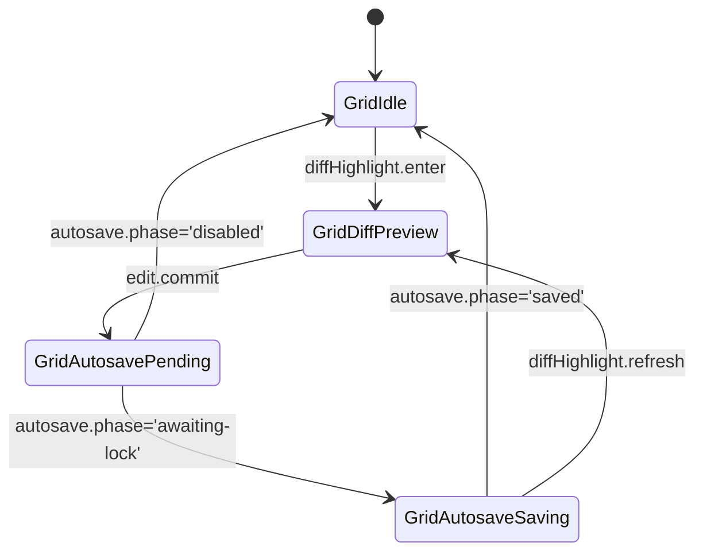
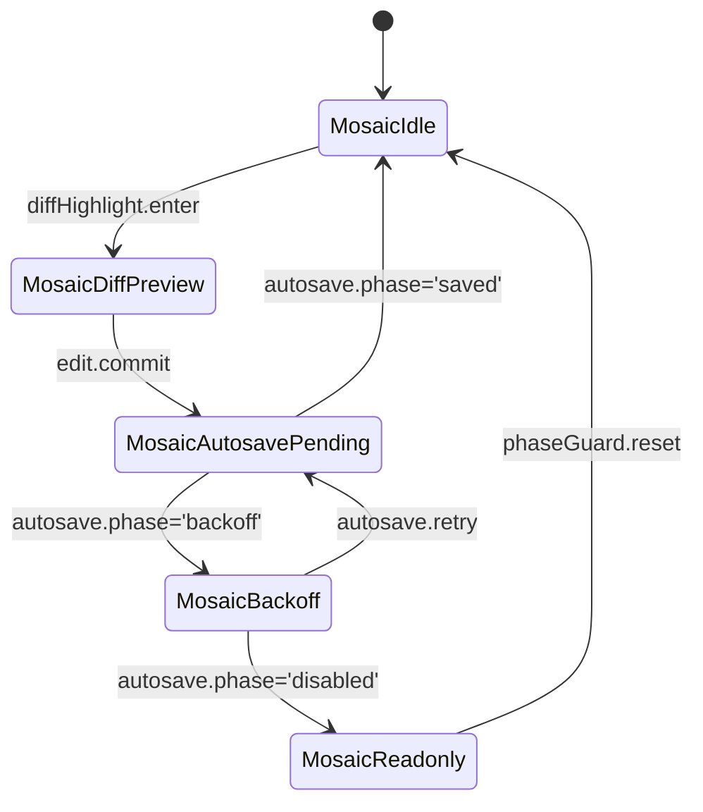
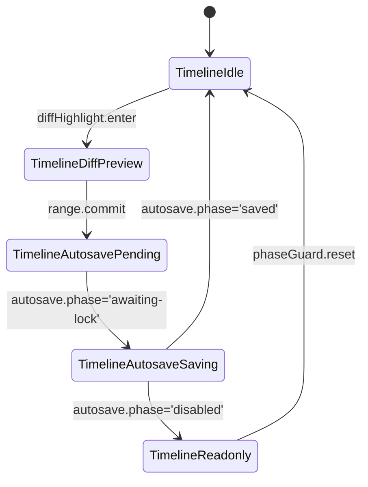
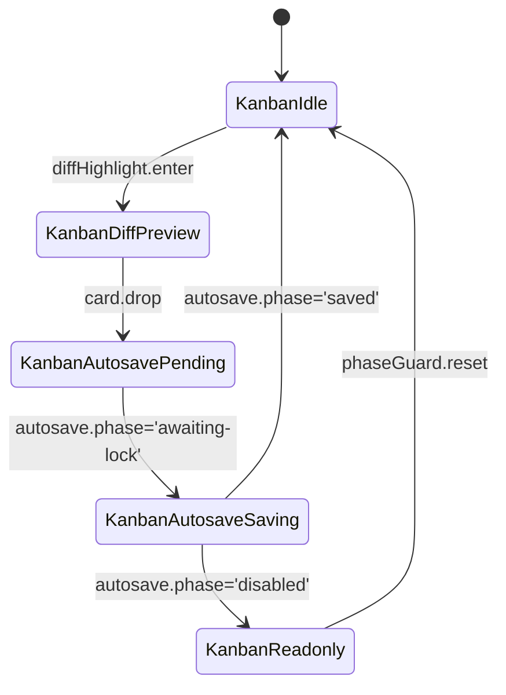

# UI-SPEC — 画面仕様

## 1. 共通
- レイアウト: 左=手入力、右=生成、下=統合（3ペイン）。
- **仮想スクロール**（100–1000カード対応）。
- D&D 並べ替え、Undo/Redo、キーボード（↑↓ / PgUp/PgDn / Ctrl+Enter）。
- ビュー切替時も AutoSave インジケータと Diff ハイライトの状態を引き継ぎ、`snapshot()` の `phase` / `pendingBytes` を共有する。

## 2. ビュー種別
### 2.1 グリッド
- 固定サイズカード。タイトル／タグ／トーン／ロックのバッジ。
- クリックで詳細（右/下ペインに反映）。
- AutoSave: `snapshot().phase` をステータスバーへ投影し、Diff ハイライト中に `autosave.phase='debouncing'` が継続する間はインライン編集をロックしない。
- 仮想スクロール: ビューポート単位で 40 枚（±10 バッファ）を保持し、スクロール端で `requestMore({ view: 'grid', cursor })` をトリガー。

#### 状態遷移

#### イベントハンドリング表
| イベント | 入力データ | AutoSave 連動 | Diff ハイライト | 仮想スクロール / キーボード |
| --- | --- | --- | --- | --- |
| `diffHighlight.enter` | `snapshot().diffs` | `pendingBytes` を UI ペインへ表示 | 対応カードの枠線を強調 | 現在ページに留まり `focusCard(id)` |
| `edit.commit` | カード編集結果 | `requestFlush({ reason: 'grid-edit' })` | 同一カードのハイライトを維持 | `maintainScrollOffset()` |
| `view.switch` | `targetView='mosaic'|...` | `snapshot()` の `phase` を渡す | 選択 ID を保持 | スクロール位置を `viewState.grid.scrollTop` に保存 |
| `keyboard.nav` | Arrow / Page キー | `snapshot()` 非同期更新 | 差分がある行にジャンプ | `virtualList.scrollToIndex()` |

### 2.2 モザイク
- 可変高さ（manual/ai の文字量に比例）。列幅はレスポンシブ。
- 高さは計測後キャッシュ（jank回避）。
- AutoSave: レンダリング前に `snapshot().phase` をチェックし、`phase='backoff'` のときは新規レンダリングを遅延して再試行状態をカードバッジで表示。
- 仮想スクロール: カラム単位で 12 カード分をキープし、再計測が入るまで `layoutCache` を再利用。

#### 状態遷移

#### イベントハンドリング表
| イベント | 入力データ | AutoSave 連動 | Diff ハイライト | 仮想スクロール / キーボード |
| --- | --- | --- | --- | --- |
| `edit.commit` | リッチテキスト差分 | `requestFlush({ reason: 'mosaic-edit' })` | 高さ再測定後もハイライト維持 | `ensureCardVisible(id)` |
| `autosave.retry` | `snapshot().lastError` | バックオフ待機終了で `requestFlush()` | エラー中は赤縁を維持 | レイアウトはキャッシュを使用 |
| `view.switch` | `targetView` | `snapshot()` を共有 | 選択カードの diff を `Phase` ごとに再描画 | スクロールは `viewState.mosaic.scrollTop` |
| `keyboard.zoom` | `+/-` | ズーム変更を AutoSave メタに含めない | ハイライト再配置 | `virtualColumns.reflow()` |

### 2.3 タイムライン
- `durationSec` を横軸にマッピング。ズーム ±、スクラブ、スナップ（0.5s）。
- 選択範囲を下ペインで統合可能。
- AutoSave: `timelineState` のズーム・スクラブ位置を `snapshot().metadata` に保持し、`phase='saving'` の間もスナップ移動を許可。
- 仮想スクロール: 横スクロールは `virtualWindow` で 15 秒単位を保持し、ズーム時に再採番。

#### 状態遷移

#### イベントハンドリング表
| イベント | 入力データ | AutoSave 連動 | Diff ハイライト | 仮想スクロール / キーボード |
| --- | --- | --- | --- | --- |
| `range.commit` | 選択範囲 (`start`,`end`) | `requestFlush({ reason: 'timeline-range' })` | ハイライトにスクラブ位置を表示 | `virtualWindow.pinTo(start)` |
| `keyboard.scrub` | `J/K` `←/→` | `snapshot()` を逐次更新しない（パフォーマンス優先） | Diff 表示をスクラブ位置と同期 | `ensureRangeVisible()` |
| `zoom.change` | `Ctrl+MouseWheel` | ズーム情報を `snapshot().viewState.timeline.zoom` に格納 | Diff 幅を再計算 | `resampleWindow()` |
| `view.switch` | `targetView` | AutoSave フェーズを共有 | ハイライトは `selectedRange` を保持 | スクロール位置とズームを保存 |

### 2.4 カンバン
- 列: `status`（draft/need_ai/review/locked 等）。列間D&Dで状態遷移。
- 列ヘッダに数（WIPメトリクス）。
- AutoSave: 列移動時に `requestFlush({ reason: 'kanban-move' })` を即発火し、`phase='saving'` の間は対象カードを半透明で表示。
- 仮想スクロール: 列ヘッダは固定、各列は 25 カードずつのスライスを保持。

#### 状態遷移

#### イベントハンドリング表
| イベント | 入力データ | AutoSave 連動 | Diff ハイライト | 仮想スクロール / キーボード |
| --- | --- | --- | --- | --- |
| `card.drop` | `fromColumn`,`toColumn`,`position` | `requestFlush({ reason: 'kanban-move' })` | 移動元/先の差分を強調 | `virtualColumns.rebalance()` |
| `column.metrics` | `snapshot().wip` | AutoSave には影響せず表示のみ | Diff で WIP delta を表示 | 列ヘッダの数値をリアルタイム更新 |
| `keyboard.nav` | `Tab/Shift+Tab` | `snapshot()` を共有 | Diff で選択カードの枠線更新 | `focusNextCard()` |
| `view.switch` | `targetView` | AutoSave フェーズを保持 | 選択列・カードを記憶 | スクロール/列展開状態を保存 |

### 2.5 ビュー共通データフロー
- 入力: `snapshot()`（`phase`,`pendingBytes`,`lastError`,`viewState`）とビュー固有パラメータ（スクロール位置、ズーム、WIP メトリクス）。
- 出力: 仮想スクロール描画情報（`visibleCards`,`bufferRange`）、AutoSave インジケータ状態（シンボル、ツールチップ、`lastSavedAt`）。
- ハンドオフ: ビュー切替時は `viewState.<mode>` にスクロール/ズームを保持し、共通ストア経由で AutoSave インジケータへ伝播。

| フェーズ | AutoSaveIndicator | Diff ハイライト | Virtual Scroll | 備考 |
| --- | --- | --- | --- | --- |
| `disabled` | `○` 灰色（Readonly） | ハイライト非表示 | キャッシュのみ復元 | Phase ガード維持 |
| `debouncing` | `●` オレンジ点灯 | ハイライト維持 | バッファ再利用 | 操作継続可 |
| `awaiting-lock` / `saving` | `↻` アニメーション | 最新差分をロック | フレーム更新頻度 60Hz まで抑制 | 操作ログ `autosave.pending` |
| `saved` | `○` 青色 | ハイライト解除指示（採用済） | バッファ再生成 | `lastSavedAt` を更新 |
| `backoff` | `↻` + 警告色 | ハイライト維持 | 新規フェッチ停止 | リトライ CTA 表示 |
| `error` | `●` 赤色 | ハイライト固定 | Virtual Scroll 停止 | Readonly 降格準備 |

## 3. 右ペイン（生成）
- v1.0 は **local‑mock** モードのみ表示：
  - テンプレ展開（snippetsの簡易版）
  - 要約/整形（ルールベース）
  - 差分表示（左とのdiff、ハイライト）
- 将来 `external-llm` に切替可能なUIスイッチを**非表示**で持つ。

## 4. 下ペイン（統合）
- 自動採用／衝突／手動編集を切替。
- しきい値スライダー（0.0–1.0、既定0.72）。
- 採用時はハイライトを消し、履歴へスナップショット保存。

### 4.1 MergeDock Phase コントロール
- `resolveMergeDockPhasePlan()` が `merge.precision` と `conimg.merge.threshold` を組み合わせ、しきい値スライダーのレンジと Diff タブ露出を制御する。
- legacy: スライダー範囲 `0.65–0.9`、Diff タブは非表示。
- beta: スライダー範囲 `0.68–0.9`。Review band（`threshold-0.02`〜`threshold+0.05`）にハンクが残る場合のみ Diff タブを opt-in 表示。
- stable: スライダー範囲 `0.7–0.94`。Review または Conflict band にハンクがあれば Diff タブを既定タブとして露出し、自動採用ターゲットを `threshold+0.03` に固定。

## 5. 保存インジケータ
- `AutoSaveIndicator` は `snapshot().phase` と `pendingBytes` を監視し、3 ペイン共通のタイトルバーに `●` / `○` / `↻` を表示する。
- `phase='backoff'` 時は `↻` をオレンジで点滅させ、ツールチップに `retry in <ms>` と `lastError.code` を表示。
- `phase='error'` は `●` を赤表示し、「再読み込み」操作のみ許可。
- ビュー切替時は現在の `phase` / `pendingBytes` / `lastSavedAt` をそのまま表示し、フラグメント再マウントを伴う場合も `AutoSaveIndicator` ストアで状態を共有。

## 6. アクセシビリティ
- フォーカスリング、ARIAロール、ラベル適用。
- キーボードのみで全操作可能。
