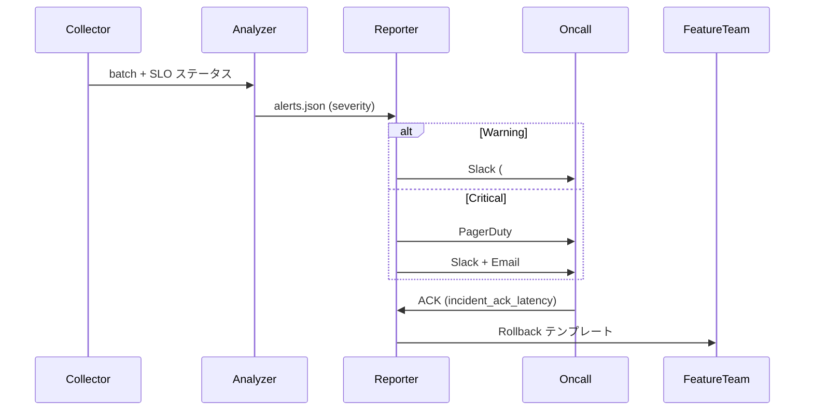

# AutoSave/精緻マージ 段階導入 監視・ロールバック設計

## 1. 目的とスコープ
- AutoSave/精緻マージの Canary → GA フェーズ移行を Day8 パイプラインで監視する。
- `docs/AUTOSAVE-DESIGN-IMPL.md` に規定された保存ポリシーとフラグ挙動、`Day8/docs/day8/design/03_architecture.md` の Collector/Analyzer/Reporter 分担に準拠する。
- 対象入出力: Telemetry JSONL、フラグ Runbook（`pnpm run flags:*`）。

## 2. 責務表
| レイヤー | 主担当 | インプット | 主要処理 | アウトプット | ロールバック責務 |
| --- | --- | --- | --- | --- | --- |
| Collector | Release Eng. | `telemetry/autosave/*.jsonl`, `telemetry/merge/*.jsonl` | 15 分 ETL（Canary: `--phase canary`, GA: `--phase ga`）。Phase タグ付与、欠損イベント補完。 | `logs/rollout/collector/<phase>/batch-<ts>.jsonl` | ETL 再実行、欠損補填。 |
| Analyzer | QA | Collector バッチ | `analyze.py --profile autosave-rollout` で SLO 判定、Why-Why 草案ドラフト。 | `reports/alerts/<phase>/<ts>.json`, `reports/metrics/<phase>/<ts>.json` | 判定誤り時の再評価、SLO 再定義。 |
| Reporter | Release Eng. | Analyzer アラート、metrics | Slack/Email 通知、`reports/rollback/` テンプレ生成、エスカレーション指示。 | `reports/daily/rollout-<date>.md`, Slack 通知 | Incident 宣言、手動フラグ操作。 |
| Feature Team | Dev Lead | Reporter 指示、`flags:rollback` 実行ログ | Phase 再設定、フォローアップタスク作成。 | `reports/postmortem/<incident>.md`, `TASKS.md` 追記 | 手動復旧、恒久対策。 |

## 3. 監視メトリクスと閾値
| フェーズ | 指標 | SLO | ロールバック基準 | 通知先 |
| --- | --- | --- | --- | --- |
| Canary (A-2/B-0) | `autosave_write_success_rate` | ≥ 99.5% | 2 バッチ連続で < 99.2% | Slack `#autosave-canary`、メール oncall | 
|  | `merge_precision_latency_p95` | ≤ 4500ms | 3 バッチ平均 > 4800ms | Slack `#autosave-canary` | 
|  | `rollback_request_rate` | = 0 | > 0.1% | PagerDuty L2 | 
| GA (B-1) | `autosave_write_success_rate` | ≥ 99.3% | 1 バッチで < 99.0% | Slack `#autosave-ga`, PagerDuty L3 | 
|  | `merge_precision_latency_p95` | ≤ 5000ms | 2 バッチ平均 > 5300ms | Slack `#autosave-ga` | 
|  | `incident_ack_latency_p90` | ≤ 15m | > 20m | Release Eng. GM | 

## 4. ロールバック手順
1. Reporter のアラートで `flags:rollback --phase <prev>` を実行。
2. 実行ログを `reports/rollback/<phase>-<timestamp>.md` に添付し、失敗時は `flags-rollback-failed` コードで記録。
3. 再試行ポリシー
   - Collector/Analyzer/Reporter 間の一時故障は最大 3 回（1m→4m→9m）でリトライ。
   - フラグ操作の失敗は再試行不可。Release Eng. が手動で `.env` を修正し、`pnpm run flags:push --env <prev>` を適用。
4. ロールバック後 30 分間は `merge.precision=legacy` を強制し、`resolveFlags()` の `source.autosaveEnabled` が `env` に戻っているか `reports/rollout-monitoring-checklist.md` で確認。

## 5. 通知フロー

## 6. エスカレーション
| 優先度 | 対応時間 | 対応者 | 条件 |
| --- | --- | --- | --- |
| P0 | 15 分以内 | Release Eng. L3 | `flags-rollback-failed`、`autosave_write_success_rate < 98%` | 
| P1 | 30 分以内 | QA Oncall | `merge_precision_latency_p95 > 5500ms` (2 バッチ) | 
| P2 | 翌営業日 | Feature Team | Canary での `rollback_request_rate > 0.1%` | 

## 7. Canary → GA 移行条件
- `reports/metrics/canary/*.json` で 48h 連続 SLO 満たす。
- `reports/rollout-monitoring-checklist.md` Canary セクションを完了し、QA/Release Eng. が署名。
- `reports/daily/rollout-<date>.md` で GA 推奨を Reporter が記載し、プロダクトオーナーが承認コメントを記録。
- `templates/alerts/rollout-monitor.md` の GA モード設定に `target_channel=#autosave-ga` が反映。

## 8. 監査ポイント（15 分 ETL & Canary 切替）
- ETL:
  - Cron → Collector ジョブのタイムスタンプと生成ファイルの `phase` フィールドを照合。
  - 欠損バッチは `reports/alerts/pending/` に `collector-missed-batch` として記録。
- Canary 切替:
  - `flags:set merge.precision beta --scope canary` 実行ログを保管。
  - Analyzer が切替後最初の 2 バッチを Canary 判定として扱っているか `reports/metrics/canary/` で確認。
  - Reporter の Slack 通知が Canary チャンネル向けに生成されることをテスト通知で検証。

## 9. 添付資料
- `scripts/monitor/README.md`: 実運用手順と再試行ルール。
- `reports/rollout-monitoring-checklist.md`: SLO チェックリスト。
- `reports/task-seed-rollout-monitoring.md`: フォローアップタスクテンプレ。
