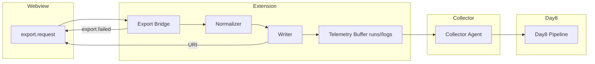

# Task 4: Export/Import ブリッジ設計メモ

## 1. 参照ドキュメントと前提
- `docs/AUTOSAVE-DESIGN-IMPL.md` のロック方針・履歴保持要件を継承し、エクスポート処理でも AutoSave ストアとの競合を避ける。
- `Day8/docs/day8/design/03_architecture.md` で定義された Collector → Day8 パイプラインのイベント規約を流用し、エクスポート成否ログを新たなストリームとして追加する。
- 既存の `src/lib/exporters.ts`・`src/lib/importers.ts` をコア橋渡し層とし、UI とは Webview メッセージ (`export.request` / `export.result`) のみで結合する。

## 2. export.request/result メッセージ契約
| メッセージ | 方向 | フィールド | 型 | 必須 | 説明 |
| --- | --- | --- | --- | --- | --- |
| `export.request` | Webview → Extension | `format` | `'markdown' \\| 'csv' \\| 'jsonl' \\| 'package'` | ✅ | 出力フォーマット。 |
|  |  | `source` | `'autosave' \\| 'storyboard'` | ✅ | エクスポート対象。`autosave` は最新の AutoSave スナップショットを利用する。 |
|  |  | `runId` | `string` (UTC ISO) | ✅ | `runs/<runId>/` 配下を一意に決定する。AutoSave の `history/<ISO>` と衝突しないよう `Z` 付与を強制。 |
|  |  | `signal` | `{ abort: boolean }` | ⭕ | 即時中断要求。true の場合は `AbortError` を返却する。 |
| `export.result` | Extension → Webview | `ok` | `boolean` | ✅ | 成功可否。 |
|  |  | `format` | 同上 | ✅ | 呼び出しと同一。 |
|  |  | `uri` | `string` | ✅ (成功時) | VS Code Webview から `vscode.env.openExternal` できる URI (`vscode-remote://...`)。 |
|  |  | `normalized` | `{ path: string; files: readonly string[] }` | ✅ (成功時) | 正規化済みディレクトリとファイル名一覧。tests でゴールデン比較に使用。 |
|  |  | `error` | `{ code: string; message: string; retryable: boolean }` | ✅ (失敗時) | `AutoSaveError` の方針に揃え、Collector 送信時も同フィールドを利用。 |

- 例外時は `{ ok: false, error }` を必ず返却し、`uri` / `normalized` は含めない。
- エラーコードは `E_EXPORT_ABORTED`, `E_EXPORT_LOCK_TIMEOUT`, `E_EXPORT_WRITE_FAILED`, `E_EXPORT_FORMAT_UNSUPPORTED` を初期セットとし、`retryable` は `lock`・`write` 系で true、それ以外は false。

## 3. フォーマット正規化と出力先
| フォーマット | 正規化手順 | 出力ファイル | メモ |
| --- | --- | --- | --- |
| Markdown | - UTF-8 (BOM 無し)<br>- 行末 `\n` 固定 (LF)<br>- 末尾空行 1 行<br>- `---` で Scene 境界を区切り、タイトルは `#` 見出し | `runs/<runId>/export/markdown/storyboard.md` | AutoSave の `current.json` を参照する場合は読み取りのみ。 |
| CSV | - UTF-8 LF<br>- RFC4180 準拠で `"` を二重化<br>- 列順: `sceneId,order,title,text` 固定<br>- ヘッダー必須 | `runs/<runId>/export/csv/storyboard.csv` | Locale 固定の `,` 区切り。 |
| JSONL | - UTF-8 LF<br>- 1 行 1 Scene<br>- キー順: `sceneId`,`title`,`text`,`tokens` (JSON.stringify with replacer)<br>- `tokens` は安定化のため `Object.keys().sort()` | `runs/<runId>/export/jsonl/storyboard.jsonl` | 既存 Importer と逆変換互換。 |
| Package | - ZIP (deflate level=9)<br>- 内部ファイルは上記 Markdown/CSV/JSONL と README (`export-info.json`) を同梱<br>- ZIP 内改行も LF | `runs/<runId>/export/package/storyboard.zip` | `export-info.json` に `runId`, `formatVersion`, `generatedAt` を含める。 |

### runs/<runId> レイアウト規約
```
runs/<runId>/
  export/
    <format>/
      storyboard.(md|csv|jsonl|zip)
  logs/
    export.jsonl        # Collector 向けイベントバッファ
```
- `runId` は ISO8601 UTC (`YYYY-MM-DDTHH-mm-ssZ`) とし、AutoSave の `history/<ISO>.json` と重複しない命名にする。
- AutoSave との競合回避: `project/autosave/` と異なるルート (`runs/`) を使用し、ロック (`withProjectLock`) を共有することで書き込みの原子性を担保。
- Windows クライアントを想定し、既存ファイルが CRLF の場合も出力は LF に正規化するが、Package の外部解凍時に BOM を挿入しないことを保証する。

## 4. AutoSave 履歴との調停
1. `withProjectLock` を取得し、AutoSave のフラッシュとエクスポート書き込みを直列化。
2. `runs/<runId>` が既存の場合は `runId` を再生成 (`<ISO>-<counter>`) して衝突を回避。
3. エクスポート完了後に `runs/<runId>/logs/export.jsonl` へ成功イベントを追記し、AutoSave GC が `runs/` をスキャンしないよう分離したルートで管理する。

## 5. ゴールデン比較テスト設計
`tests/export/golden.webview.test.ts` に RED スケルトンを追加し、以下を TODO 管理する。
- Markdown/CSV/JSONL それぞれについて `normalizeExport(format)` の結果を `tests/fixtures/export/golden/<format>/storyboard.*` と厳密比較する。
- Package 出力では ZIP を展開し、上記 3 ファイルと `export-info.json` の整合性・メタデータを検証する。
- `export.result` の URI / normalized パスが `runs/<runId>/export/<format>/` を返すことをアサートする。
- エラー系 (ロック取得失敗、フォーマット不明、書き込み失敗) をモックし、`retryable` フラグと Collector 送信が行われるかを検証する。

## 6. Telemetry 更新
| Event 名 | トリガー | Payload | Collector 転送先 |
| --- | --- | --- | --- |
| `export.started` | `export.request` 受付後 | `{ runId, format, source }` | Day8 `export_bridge` topic |
| `export.succeeded` | 正常完了時 | `{ runId, format, uri, normalizedPath, durationMs, fileSize }` | 同上 |
| `export.failed` | エラー時 | `{ runId, format, error: { code, retryable } }` | `export_bridge` topic |
| `export.retry` | `retryable=true` で再実行時 | `{ runId, format, attempt }` | Collector 経由で Day8 |

- Telemetry は `runs/<runId>/logs/export.jsonl` にもミラーリングし、Collector がバッチ送信時に Day8 へフォワードする。
- `retryable=false` の場合は UI への即時通知 (toast) と Collector への `severity='error'` を設定。

## 7. Day8 パイプライン連携フロー


## 8. 本日のチェック項目
- [ ] フォーマット別正規化関数 (`normalizeExport`) 実装
- [ ] `export.request/result` ハンドシェイク実装と URI 発行
- [ ] ゴールデン比較テスト (Markdown/CSV/JSONL/Package) GREEN 化
- [ ] Telemetry Collector → Day8 送信動作の統合テスト
